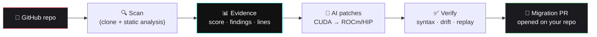

<div align="center">

# ⚡ ROCmPorter

### Break free from CUDA lock-in. Ship on AMD in minutes.

**ROCmPorter scans any GitHub repository for NVIDIA / CUDA dependencies, scores its AMD ROCm readiness with line-level evidence, and opens a pull request that migrates your code — automatically.**

<br/>


<br/>
<br/>

[](https://rocmporter-agent.vercel.app)
&nbsp;
[](https://rocmporter-agent.vercel.app)

[](https://github.com/pavansai20052004-hue/rocmporter-agent/actions/workflows/rocm-compile-validate.yml)
[](LICENSE)
[](backend/)
[](frontend/)
[](#-deployment)
[](https://github.com/pavansai20052004-hue/rocmporter-agent/pulls)

**[🚀 Try the live app](https://rocmporter-agent.vercel.app)** · **[✨ Features](#-features)** · **[🔧 How it works](#-how-it-works)** · **[🤖 Use in CI](#-use-it-in-your-ci)** · **[💬 Roadmap](#-roadmap)**

</div>

---

## 🎯 Why ROCmPorter exists

A massive amount of GPU code is **locked to NVIDIA CUDA** — `nvcc` in the build, `cudaMalloc` in the kernels, `torch.cuda` everywhere, NVIDIA-only Docker images. That lock-in is expensive: NVIDIA GPUs cost more and are harder to get, while **AMD GPUs (via ROCm)** are often cheaper and more available.

The catch? Porting CUDA → ROCm today means **reading the entire repo by hand** and rewriting every NVIDIA-specific line. Most teams never do it. So they stay stuck.

**ROCmPorter automates the painful 90%:**

> Point it at a repo → get evidence-backed findings and a readiness score → generate verified ROCm patches → **open a migration pull request** — in minutes, not months.

<br/>

<div align="center">

### 👉 **[See it live — scan any public repo, free](https://rocmporter-agent.vercel.app)** 👈

</div>

---

## ✨ Features

| | |
|---|---|
| 🔍 **Evidence-driven scans** | Every finding cites the exact **file, line, and code snippet**. No hand-waving — proof you can click. |
| 📊 **ROCm readiness score** | A 0–100 portability score + risk level + migration checklist for any repository. |
| 🤖 **Hybrid hipify + AI patches** | A deterministic CUDA→HIP mapping pass converts the mechanical majority with **zero AI**; the model only handles the semantic remainder — with per-file provenance. |
| 📚 **Docs-grounded AI** | The AI remainder is grounded in a curated ROCm migration knowledge base (warp-size 64, cuDNN→MIOpen, rocThrust, torch-on-ROCm semantics…) — facts, not vibes. |
| 🧪 **ROCm compile validation** | Migrated code is compile-checked with real `hipcc` in AMD's official ROCm container in CI — [see the guide](docs/rocm-validation.md). |
| 🧩 **VS Code extension** | CUDA lock-in underlined as you code, HIP equivalents on hover, quick fixes, and one-click file hipify — [vscode-extension/](vscode-extension/). |
| 🚀 **One-click Migration PRs** | Migrates *every* flagged file and **opens a pull request** on your repo. The moat feature. |
| ✅ **Verify before apply** | Syntax checks, drift detection, artifact hashes, and diff replay before anything touches your code. |
| 🐙 **GitHub-native** | Sign in with GitHub, scan public **and private** repos, get PR-ready review artifacts. |
| 📦 **Audit-grade exports** | Offline HTML / JSON / Markdown / diff / checksummed zip bundles for CI and compliance. |
| 🏷️ **CI Action + badge** | A GitHub Action that comments readiness on every PR, plus a live `ROCm ready` README badge. |

---

## 🔧 How it works



1. **Scan** — deterministic static-analysis rules clone the repo and flag CUDA/NVIDIA assumptions, citing exact evidence.
2. **Score** — findings roll up into a ROCm portability score, risk level, and migration checklist.
3. **Patch** — a hosted LLM drafts ROCm/HIP patches, which are syntax-checked, risk-scored, and verified with diff replay before export or apply.
4. **Ship** — export audit bundles, post GitHub PR reviews, or **open a full-repo migration pull request** with one click.

---

## 🤖 Use it in your CI

Add a **ROCm readiness comment to every pull request** with one workflow file:

```yaml
# .github/workflows/rocm-readiness.yml
name: ROCm readiness
on: [pull_request]
permissions:
  pull-requests: write
jobs:
  scan:
    runs-on: ubuntu-latest
    steps:
      - uses: pavansai20052004-hue/rocmporter-agent@main
        # optional:
        # with:
        #   fail-below: '50'   # fail the check if readiness drops below 50
```

Every PR gets a live comment with the score, risk, and top findings — updated in place on each push.

### README badge

Show your repo's latest ROCm readiness anywhere:

```markdown

```

Green ≥ 80 · amber ≥ 50 · red below. (The badge at the top of this page is live for `pytorch/extension-cpp`.)

---

## 🖼️ See it in action

The best way to experience ROCmPorter is live. The hosted app features an animated scanning sequence, a 3D hero, a full dashboard, and one-click migration PRs.

<div align="center">

### ▶ **[Open the live app →](https://rocmporter-agent.vercel.app)**

*Paste any public GitHub repository and watch it scan in real time — no signup required.*

</div>

**What you'll see:**

- 🔍 An **evidence-backed report** — every CUDA finding with its exact file, line, and snippet
- 📊 A **ROCm readiness score** (0–100) with risk level and a migration checklist
- 🤖 **AI patches** with a live radar-scan animation and a staged results reveal
- 🚀 A **"Open Migration PR"** button that ports the whole repo and opens a pull request

---

## 💳 Pricing

| Plan | Price | For |
|---|---|---|
| **Free** | $0 forever | Unlimited public-repo scans, full reports, migration checklist, offline exports |
| **Pro** | $29/mo (or ₹ via Razorpay) | AI patches · one-click migration PRs · verify + safe apply/rollback · private repos |
| **Team** | Custom | CI/CD pipelines · AMD Developer Cloud validation · shared bundles & seats |

Payments via **Stripe** (global) or **Razorpay** (India — UPI, cards, netbanking). Card details never touch our servers.

---

## 🧱 Tech stack

- **Frontend** — React 19 + Vite, React Router, a custom dark design system with 3D/motion (no heavy libraries). Hosted on **Vercel**.
- **Backend** — FastAPI (Python), deterministic static-analysis engine, `git` cloning, hosted-LLM patch generation. Hosted on **Render**.
- **Auth + DB** — Supabase (GitHub + Google OAuth, Postgres, row-level security).
- **AI** — pluggable provider (OpenAI / Groq / OpenRouter / Together / DeepSeek / Anthropic, or local Ollama for dev).
- **Payments** — Stripe + Razorpay.

```
frontend/   React app (landing, auth, dashboards, scanner)
backend/    FastAPI API (scan, patch, migrate, billing, badge)
action.yml  GitHub Action (PR readiness comments)
supabase/   Database schema
```

---

## 🚀 Deployment

ROCmPorter is a two-part app: the **frontend** (Vercel) and the **backend** (Render — it needs a real server for `git` + scanning; it cannot run on serverless).

See **[DEPLOY.md](DEPLOY.md)** for the full runbook and **[SETUP.md](SETUP.md)** for enabling auth, GitHub/Google login, and payments.

## 💻 Run locally

```bash
# Backend (FastAPI)
cd backend
python -m venv .venv && .venv/Scripts/pip install -r requirements.txt
.venv/Scripts/python -m uvicorn app.main:app --reload --port 8000

# Frontend (Vite)
cd frontend
npm install
npm run dev
```

For local AI patches, run [Ollama](https://ollama.com) with a coding model; or set `LLM_PROVIDER` + `LLM_API_KEY` to use a hosted model. Full config in [`backend/.env.example`](backend/.env.example).

---

## 💬 Roadmap

- [x] Evidence-backed CUDA scans + readiness score
- [x] AI single-file ROCm patches with verification
- [x] GitHub + Google auth, private-repo scanning
- [x] One-click full-repo **Migration PRs**
- [x] GitHub Action + live readiness badge
- [x] Stripe + Razorpay billing
- [x] **Hybrid migration engine** — deterministic hipify pass first, AI only for the semantic remainder (per-file "N deterministic + AI remainder" provenance)
- [x] **ROCm compile validation** — `hipcc` checks in AMD's official container on every PR ([guide](docs/rocm-validation.md))
- [x] **VS Code extension** — inline CUDA lock-in diagnostics, HIP hovers, one-click hipify ([vscode-extension/](vscode-extension/))
- [x] **Docs-grounded patches** — AI remainder grounded in a curated CUDA→HIP knowledge base (18 API-family notes, deterministic retrieval)
- [x] **Cross-file migration context** — migration PRs read local headers for consistency, up to 10 files per PR
- [ ] GPU **execution** validation on AMD Developer Cloud (self-hosted runner receipt)
- [ ] Team workspaces & shared audit history

---

## 🤝 Contributing

Issues and PRs are welcome. Found CUDA that ROCmPorter missed? [Open an issue](https://github.com/pavansai20052004-hue/rocmporter-agent/issues) with the repo and file.

## 📄 License

[MIT](LICENSE) © 2026 GJV Pavansai

<div align="center">
<br/>

**Built for the AMD ecosystem — helping the world escape CUDA lock-in.**

### ⭐ [Star this repo](https://github.com/pavansai20052004-hue/rocmporter-agent) · [Try it live](https://rocmporter-agent.vercel.app)

</div>
