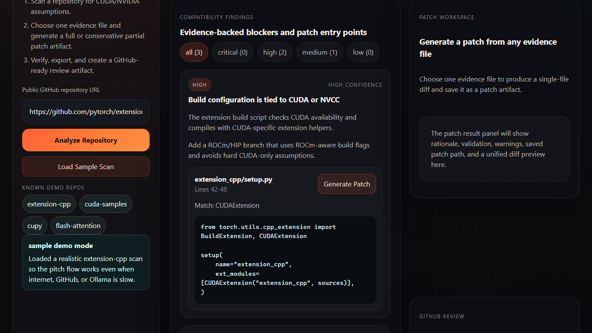

<div align="center">

# ROCmPorter Agent

**Point it at any CUDA repo. Get an AMD ROCm readiness report — with evidence, risk scores, and verified patch suggestions.**

Local-first · No cloud GPU required · Powered by FastAPI + React + Ollama

[**🚀 Try the live demo**](https://rocmporter-agent.vercel.app) · [Screenshots](docs/screenshots/README.md) · [How it works](#what-the-mvp-does) · [Run locally](#run-locally)

[](LICENSE)
[](backend/requirements.txt)
[](frontend/package.json)
[](https://github.com/pavansai20052004-hue/AMD_HACKTHON/pulls)



</div>

## Why this exists

A huge amount of GPU code is locked to CUDA — build scripts that hard-require `nvcc`, `CUDAExtension` in `setup.py`, NVIDIA-only Docker base images, `cupy` imports. Porting it to AMD ROCm today means reading the whole repo by hand.

ROCmPorter Agent automates the first 80% of that work:

1. **Scan** — deterministic static-analysis rules find CUDA/NVIDIA assumptions and cite the exact file and line as evidence.
2. **Score** — every finding gets a risk level and confidence, rolled up into a ROCm portability score and migration checklist.
3. **Patch** — a local LLM (via [Ollama](https://ollama.com)) drafts single-file ROCm patch diffs, which are then syntax-checked, semantically risk-scored, and verified with diff replay and artifact hashes before anything can be exported or applied.
4. **Ship** — export offline HTML/JSON/Markdown reports, GitHub-ready PR review comments, and CI-friendly bundles.

Honesty note: verified benchmark artifacts are **export-ready review bundles, not apply-ready migrations**. Workspace apply is available only when a verification receipt explicitly returns `applyReady=true` — the tool refuses to pretend a patch is safe when it isn't.

## Live demo (zero install)

- **Vercel (primary):** <https://rocmporter-agent.vercel.app>
- GitHub Pages (mirror): <https://pavansai20052004-hue.github.io/AMD_HACKTHON/>

The hosted build runs in **sample mode** by default — click `Load Sample Scan` to walk the full report → patch → verify → export flow entirely offline. To drive the hosted UI from a real local backend, start the backend, expose it over HTTPS (for example `cloudflared tunnel --url http://127.0.0.1:8000`), add the hosted origin to `APP_CORS_ORIGINS` in `backend/.env`, then open:

```text
https://rocmporter-agent.vercel.app/?api=https://<your-tunnel>.trycloudflare.com
```

The override must be an HTTPS URL (browsers block plain-http API calls from an https page) and persists in the browser; clear it with `?api=reset`.

## Prerequisites

- Python 3.10+ (3.11 recommended)
- Node.js 20+
- Git on PATH (used for repository cloning)
- Optional: [Ollama](https://ollama.com) with a coding model such as `qwen2.5-coder` for local patch generation

The `scripts/local/*.ps1` helpers are Windows PowerShell conveniences; the manual `uvicorn` + `vite` commands in *Run locally* work on any OS.

## Judge Quick Start

1. Read the portal-ready pitch: [docs/submission-pitch.md](docs/submission-pitch.md)
2. Review the tracked proof summary: [docs/benchmark-proof/submission-proof-v2-summary.md](docs/benchmark-proof/submission-proof-v2-summary.md)
3. Open the screenshot gallery: [docs/screenshots/README.md](docs/screenshots/README.md)
4. Install dependencies once, then start the local product:

   ```powershell
   cd backend; python -m venv .venv; .\.venv\Scripts\python -m pip install -r requirements.txt; cd ..
   cd frontend; npm install; cd ..
   .\scripts\local\start-local-dev.ps1
   ```

5. Open `http://127.0.0.1:5178` and click `Load Sample Scan` for the fastest reliable demo.

No time to install? Use the [hosted demo](https://rocmporter-agent.vercel.app) in sample mode instead.

## Submission Package

Create portal uploads from Git, not from the whole desktop folder. The working directory can contain ignored local artifacts such as `work/`, `frontend/node_modules/`, `backend/.venv/`, and Playwright output.

```powershell
git archive --format zip HEAD -o AMD_HACKTHON-submission.zip
```

## Stack

- `frontend/`: React + Vite report UI
- `backend/`: FastAPI scan API with deterministic static-analysis rules

## What the MVP does

1. Accepts a GitHub repository URL
2. Clones the repository with a shallow fetch
3. Scans for CUDA files, CUDA headers, build-system assumptions, container signals, and Python GPU package clues
4. Returns a ROCm portability score, findings, and a migration checklist
5. Generates single-file ROCm patch diffs per evidence file through local Ollama
6. Validates generated patches where local syntax tooling is available and surfaces warnings when review is still required
7. Scores patch review risk with CUDA and ROCm-aware semantic heuristics instead of trusting syntax alone
8. Generates GitHub-ready PR review comments with suggested patch text and optional comment posting
9. Supports private GitHub repository cloning through a local PAT in `backend/.env`
10. Applies generated patches only inside the scanned workspace copy with backup-and-restore rollback
11. Verifies patches with syntax checks, source drift checks, artifact hashes, and diff replay before apply/export
12. Exports offline HTML, JSON, Markdown, diff, GitHub review, verification receipt, checksum, and zip artifacts for sharing or CI

Live validation notes are tracked in [docs/live-demo-receipt.md](docs/live-demo-receipt.md).

## Run locally

Backend:

```powershell
cd backend
python -m venv .venv
.\.venv\Scripts\python -m pip install -r requirements.txt
.\.venv\Scripts\python -m uvicorn app.main:app --reload --host 127.0.0.1 --port 8000
```

Optional local secrets:

```powershell
Copy-Item .env.example .env
```

Frontend:

```powershell
cd frontend
npm install
npm run dev -- --host 127.0.0.1 --port 5178
```

If the frontend is hosted separately from Vite dev proxy, create `frontend/.env` from `frontend/.env.example` and set:

```powershell
VITE_API_BASE_URL=http://127.0.0.1:8000
```

Backend CORS can be widened with:

```powershell
APP_CORS_ORIGINS=http://localhost:5178,http://127.0.0.1:5178
```

Optional Ollama override:

```powershell
OLLAMA_HOST=http://127.0.0.1:11434
```

Private GitHub repository access:

```powershell
GITHUB_PAT=ghp_your_token_here
```

The Vite dev server proxies `/api/*` requests to the FastAPI server on port `8000`.

## Ollama setup

The local patch workflow expects Ollama running on the machine with at least one coding model installed.

Example:

```powershell
ollama list
ollama run qwen2.5-coder
```

## Local-first mode

Paid AMD cloud access is optional. The product can be developed and demoed locally with Ollama, CPU syntax validation, offline artifacts, and free scan-only GitHub Actions.

From the repository root:

```powershell
.\scripts\local\check-local.ps1
.\scripts\local\check-local.ps1 -RunChecks
.\scripts\local\start-local-dev.ps1
```

The local launcher writes logs and state under `work\local-dev\`. Use `.\scripts\local\status-local-dev.ps1` to verify the running stack and `.\scripts\local\stop-local-dev.ps1` to stop the backend/frontend services cleanly.

See [docs/local-first-runbook.md](docs/local-first-runbook.md) for the complete local runbook.

For judging and team rehearsals, use [docs/demo-script.md](docs/demo-script.md). It includes the live demo path, sample-mode fallback, ROCm proof substitute, GitHub Actions story, and pitch notes.

For repeatable multi-repo patch benchmarking, use [benchmarks/submission-proof-cases.json](benchmarks/submission-proof-cases.json) for the fast 3-case submission proof, [benchmarks/demo-cases.json](benchmarks/demo-cases.json) for the broad smoke path, [benchmarks/quality-check-cases.json](benchmarks/quality-check-cases.json) for the focused conservative-partial benchmark, [benchmarks/selection-check-cases.json](benchmarks/selection-check-cases.json) to verify automatic evidence selection on larger repos, or [benchmarks/judge-quality-cases.json](benchmarks/judge-quality-cases.json) as the candidate pinned 6-case judge-quality patch suite.

Latest verified submission proof: [docs/benchmark-proof/submission-proof-v2-summary.md](docs/benchmark-proof/submission-proof-v2-summary.md) records 3 of 3 cases with 3 export-ready review artifacts, 0 export blocks, 0 infrastructure failures, and 0 high-risk patches. The raw local output was captured at `work\benchmark-runs\submission-proof-v2\summary.json`.

## CLI

From `backend/`:

```powershell
.\.venv\Scripts\python rocmporter.py models
.\.venv\Scripts\python rocmporter.py scan https://github.com/pytorch/extension-cpp --export json,md,html,zip,github
.\.venv\Scripts\python rocmporter.py patch scan_id --finding-id cuda_build_config --evidence-path extension_cpp/setup.py --export json,md,diff,html,zip,github
.\.venv\Scripts\python rocmporter.py verify-patch scan_id --patch-id patch_id
.\.venv\Scripts\python rocmporter.py apply-patch scan_id --patch-id patch_id
.\.venv\Scripts\python rocmporter.py rollback-patch --apply-id apply_id
.\.venv\Scripts\python rocmporter.py run https://github.com/pytorch/extension-cpp --finding-id cuda_build_config --evidence-path extension_cpp/setup.py --export json,md,diff,html,zip,github
.\.venv\Scripts\python rocmporter.py github-review scan_id --patch-id patch_id --pr-number 42
.\.venv\Scripts\python rocmporter.py benchmark --cases ..\benchmarks\submission-proof-cases.json --model qwen2.5-coder:latest --out ..\work\benchmark-runs\submission-proof-local
.\.venv\Scripts\python rocmporter.py benchmark --cases ..\benchmarks\demo-cases.json --model qwen2.5-coder:latest
.\.venv\Scripts\python rocmporter.py benchmark --cases ..\benchmarks\judge-quality-cases.json --model qwen2.5-coder:latest --out ..\work\benchmark-runs\judge-quality-local
```

CLI artifacts are written under `work/cli_exports/` by default.

Benchmark artifacts are written under `work/benchmarks/` by default, or a custom `--out` directory when provided. Fresh benchmark runs record `qualityLane`, `judgeSignal`, `runStatus`, planned case count, and remaining case count so blocked patches, review-ready artifacts, scanner gaps, generation failures, infrastructure failures, and interrupted runs are visible in `summary.json` and `summary.md`.

Generated export bundles include:

- `report.json`
- `summary.md`
- `index.html`
- `github-review.md`
- `github-review.json`
- `github-review-inline-comments.json` or equivalent inline review artifact file
- `manifest.json`
- `SHA256SUMS.txt`
- `data/` scan, coverage, evidence, and patch metadata
- `patches/*.diff`
- `patch-verification.json`
- `verification/*-verification.json`
- `bundle.zip`

Patch exports are blocked unless the latest verification receipt is export-ready. Patch apply is blocked unless the receipt is apply-ready. Each patch stores an immutable source snapshot under `work/patches/source/<patch_id>/...` so exported source context does not drift from the diff.

## Quality checks

Frontend (Playwright browsers install once with `npx playwright install chromium`):

```powershell
cd frontend
npm run lint
npm run build
npm run test:e2e
```

Backend (use the project venv interpreter — the tests import FastAPI/pydantic):

```powershell
backend\.venv\Scripts\python -m compileall backend\app
backend\.venv\Scripts\python -m unittest discover -s backend\tests
```

## Hosted deployments

The static frontend deploys to two targets; the FastAPI backend stays local by design (it clones repositories to disk and talks to a local Ollama daemon, so it is not a fit for serverless hosting):

- **Vercel:** configured by [frontend/vercel.json](frontend/vercel.json) (immutable asset caching, security headers, no SPA rewrites so `/api/*` fails fast into the app's offline messaging). Deploy with `cd frontend && vercel deploy --prod`. In the Vercel dashboard the project root directory is `frontend`; leave `VITE_API_BASE_URL` unset so the hosted demo stays in sample mode.
- **GitHub Pages:** deployed automatically by [.github/workflows/deploy-pages.yml](.github/workflows/deploy-pages.yml) on pushes to `main` that touch `frontend/`.

Both hosted builds support the `?api=<https-url>` runtime override described in *Live demo* above.

## GitHub Action

A real workflow now lives at [.github/workflows/rocmporter-agent.yml](.github/workflows/rocmporter-agent.yml).

- Scan-only runs on `ubuntu-latest`
- Frontend quality checks run lint, build, and Playwright smoke tests
- Scan plus patch runs on a labeled self-hosted runner with Ollama
- AMD Developer Cloud ROCm validation runs from [.github/workflows/amd-devcloud-rocm-validation.yml](.github/workflows/amd-devcloud-rocm-validation.yml) on a self-hosted AMD/ROCm runner when free GPU access is available
- Phase 4 can also generate GitHub review artifacts. Posting is optional and requires `--post`, a PR number, export-ready verification, and a token with write permission; inline comments are filtered against the current PR diff.
- Phase 5 adds PAT-based private repo access and line-aware review artifacts for PR workflows
- Both upload the export bundle as a workflow artifact

## Next upgrade ideas

- Add an LLM-written executive summary on top of the deterministic findings
- Add direct web-based patch apply once the CLI rollback flow has enough mileage
- Add ROCm hardware benchmark capture when free AMD GPU access is available

## Contributing

Issues and PRs are welcome — especially new CUDA-detection rules, ROCm/HIP mapping improvements, and real-world repos where the scanner misses something. Open an issue with a repo link and what you expected, and it becomes a test case.

## License

[MIT](LICENSE) — free to use, fork, and build on.

---

<div align="center">

Built for the AMD hackathon. If ROCmPorter saves you porting time, a ⭐ helps other GPU developers find it.

</div>
