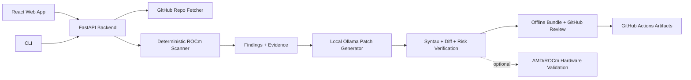

# ROCmPorter Demo Script

Use this as the stable judging demo. The goal is to show a real product flow first, then explain the fallback path if network or Ollama is slow.

## Project title

ROCmPorter Agent - Local LLM Assistant for CUDA-to-AMD ROCm Migration

## One-minute explanation

ROCmPorter Agent helps developers move CUDA/NVIDIA-heavy repositories toward AMD ROCm. It scans a GitHub repo, finds CUDA source files, CUDA headers, NVIDIA runtime assumptions, GPU package risks, and CUDA-specific build configuration. Then it lets the developer choose one evidence file and generate a single-file ROCm review artifact using local Ollama. That artifact can be a full narrow patch or a conservative partial diff when a one-file migration would otherwise be misleading. The product does not blindly apply AI output: it stores the diff, validates syntax where possible, creates a verification receipt, scores review risk, and exports an offline bundle plus GitHub-ready review artifacts. The product is local-first, so teams can use it without paid cloud APIs, and AMD hardware validation can be added later as a stronger proof step.

## Perfect live demo path

1. Start local services:

   ```powershell
   .\scripts\local\check-local.ps1 -RunChecks
   .\scripts\local\start-local-dev.ps1
   .\scripts\local\status-local-dev.ps1
   ```

2. Final pre-demo proof run:

   ```powershell
   .\scripts\local\run-benchmarks.ps1 -CaseFile benchmarks\submission-proof-cases.json -Out work\benchmark-runs\submission-proof-local
   ```

   Latest verified reference run: `work\benchmark-runs\submission-proof-v2\summary.json` completed 3 of 3 cases with 3 export-ready review artifacts, 0 infrastructure failures, and 0 high-risk patches.

3. Open:

   ```text
   http://127.0.0.1:5178
   ```

4. Scan the demo repository:

   ```text
   https://github.com/pytorch/extension-cpp
   ```

   The UI also includes a `Known Demo Repos` picker. Use `extension-cpp` first because it is small and predictable.

5. Choose:

   - Finding: `cuda_build_config`
   - Evidence file: `extension_cpp/setup.py`
   - Model: `qwen2.5-coder:latest`

6. Generate one patch.

7. Show these proof points:

   - File-level evidence and line snippet
   - Unified diff
   - Syntax validation result
   - ROCm semantic sanity result
   - Review risk score
   - Verification receipt
   - Export bundle
   - GitHub review artifact

   Posting to GitHub is optional. It requires `--post`, a PR number, export-ready verification, and a token with write permission.

## Fallback demo path

If GitHub, internet, Ollama, or the backend is slow:

1. Click `Load Sample Scan`.
2. Show the extension-cpp sample report.
3. Click `Generate Patch` on the first finding.
4. Click `Export With Patch`.
5. Click `Build GitHub Review`.

This path demonstrates the product workflow and UI without pretending that a live model call happened.

At the end of a rehearsal or judging session, stop the local services with:

```powershell
.\scripts\local\stop-local-dev.ps1
```

## Demo repository bench list

Use these in order when testing patch quality:

1. `https://github.com/pytorch/extension-cpp` - small, best for a clean live demo.
2. `https://github.com/NVIDIA/cuda-samples` - CUDA-heavy scanner coverage benchmark.
3. `https://github.com/cupy/cupy` - large GPU Python package with CUDA package/build assumptions.
4. `https://github.com/Dao-AILab/flash-attention` - advanced CUDA kernels and packaging signals.

You can run the scripted version with:

```powershell
.\scripts\local\run-benchmarks.ps1
```

## ROCm proof substitute

Until AMD GPU access is available, use these proof layers:

- Deterministic CUDA/NVIDIA static scan
- Evidence file and line capture
- Single-file unified diff
- Source snapshot hashing
- Diff replay verification
- Syntax validation where local tooling exists
- ROCm semantic sanity checks for invented APIs or unsafe single-file assumptions
- Response-artifact leak detection
- Review risk score and approval checklist
- Export checksum file
- Optional AMD Developer Cloud validation workflow for later hardware proof

## GitHub Actions story

The shipped workflow has two modes:

- Scan-only runs on GitHub-hosted `ubuntu-latest`.
- Patch generation runs only on a self-hosted runner labeled `ollama`, because local model inference is required.

This is intentional. We should not claim GitHub-hosted runners can run local Ollama patch generation reliably.

## Security story

- GitHub tokens stay in `backend/.env` or GitHub Actions secrets.
- Browser requests never send tokens directly.
- Web export responses show relative artifact paths instead of server absolute paths.
- `.env`, `work/`, `output/`, virtual environments, Playwright reports, and dependency folders are ignored by Git.
- Private repository support uses Git extra headers instead of embedding tokens in clone URLs.

## Architecture diagram



## Screenshots to capture

- First screen with `Load Sample Scan`
- Sample report with findings
- Patch workspace after sample patch
- Export bundle list
- GitHub review preview
- Mobile layout first screen
- Live demo receipt from `docs/live-demo-receipt.md`

## What to say if asked about AMD

This product is AMD-focused because ROCm migration is a real blocker for developers with CUDA-first projects. ROCmPorter reduces migration uncertainty by finding NVIDIA assumptions, creating a reviewable first patch, and preparing validation evidence. The product is designed so AMD hardware validation plugs in naturally when GPU access is available.
